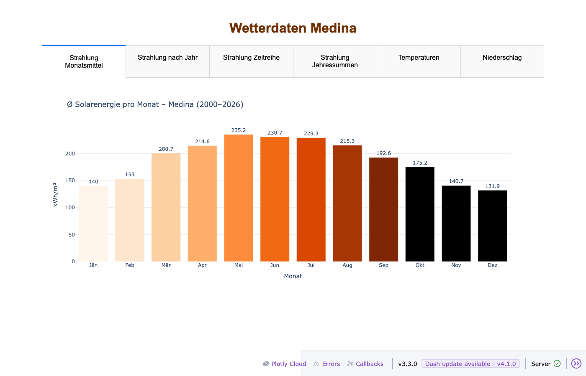

# WeatherHistory

Historische Wetterdaten abrufen und interaktiv visualisieren – powered by [Open-Meteo](https://open-meteo.com/) und [Dash/Plotly](https://dash.plotly.com/).

## Überblick

Dieses Projekt lädt stündliche Wetterdaten der Open-Meteo Archiv-API für beliebige Standorte herunter, aggregiert sie zu Tageswerten und stellt sie in einem interaktiven Web-Dashboard dar. Aktuell konfiguriert für **Wien**, **Casablanca**, **Medina**, **Rom** und **Lissabon**.

## Voraussetzungen

- Python 3.13+
- Abhängigkeiten installieren:

```bash
pip install requests dash plotly pandas numpy
```

## Verwendung

### 1. Wetterdaten abrufen

```bash
python3 WeatherHistoryWien.py
python3 WeatherHistoryCasablanca.py
python3 WeatherHistoryMedina.py
python3 WeatherHistoryRome.py
python3 WeatherHistoryLisbon.py
```

Erzeugt jeweils eine CSV-Datei mit täglichen Min/Max/Durchschnittswerten für Strahlung, Temperatur, Luftfeuchtigkeit, Luftdruck, Bewölkung und Niederschlag.

### 2. Dashboard starten

```bash
python3 StrahlungDashAlle.py        # http://localhost:8055
```

## Screenshot



## Dashboard-Inhalte

Stadt per Dropdown auswählen, Light/Dark-Theme per Schaltfläche umschalten. Acht Tabs:

| Tab | Inhalt |
| --- | --- |
| Strahlung Monatsmittel | Ø kWh/m² pro Kalendermonat über alle Jahre |
| Strahlung nach Jahr | Monatliche kWh/m² für ein wählbares Jahr |
| Strahlung Zeitreihe | Alle Monate als Balkendiagramm mit Range-Slider |
| Strahlung Jahressummen | Jährliche Gesamtstrahlung mit Durchschnittslinie |
| Temperaturen | Monatliche Ø-Temperatur, gesamt oder nach Jahr |
| Niederschlag | Monatlicher Niederschlag in mm mit Jahressumme |
| Temp. Jahrestrend | Jährliche Ø-Temperatur mit linearem Fit (°C/Dekade) |
| Niederschlag Jahrestrend | Jährlicher Gesamtniederschlag mit linearem Fit (mm/Dekade) |

## Neue Stadt hinzufügen

1. `WeatherHistoryXxx.py` anlegen:

```python
from weather_fetch import fetch_weather_data

if __name__ == "__main__":
    fetch_weather_data(
        latitude=...,
        longitude=...,
        timezone="Continent/City",
        filename="xxx_wetter.csv",
        start_date="1980-01-01",
    )
```

1. Eintrag in `STAEDTE`-Dict in `StrahlungDashAlle.py` hinzufügen (Farben, Temperaturschwellen, Dateiname).
1. Fetch-Script ausführen, dann Dashboard neu starten.

## Projektstruktur

```text
weather_fetch.py          # Library: Datenabruf via Open-Meteo API
weather_dash_lib.py       # Library: Datenaggregation (load_data)
StrahlungDashAlle.py      # Kombiniertes Dashboard (Port 8055)
assets/theme.css          # CSS für Light/Dark-Theme
WeatherHistoryWien.py     # Wien: Datenabruf (48.2°N, 16.4°E)
WeatherHistoryCasablanca.py
WeatherHistoryMedina.py
WeatherHistoryRome.py
WeatherHistoryLisbon.py
```

## Datenquelle

[Open-Meteo Historical Weather API](https://open-meteo.com/en/docs/historical-weather-api) – kostenlos, keine Registrierung erforderlich. Daten ab 1940 verfügbar.
